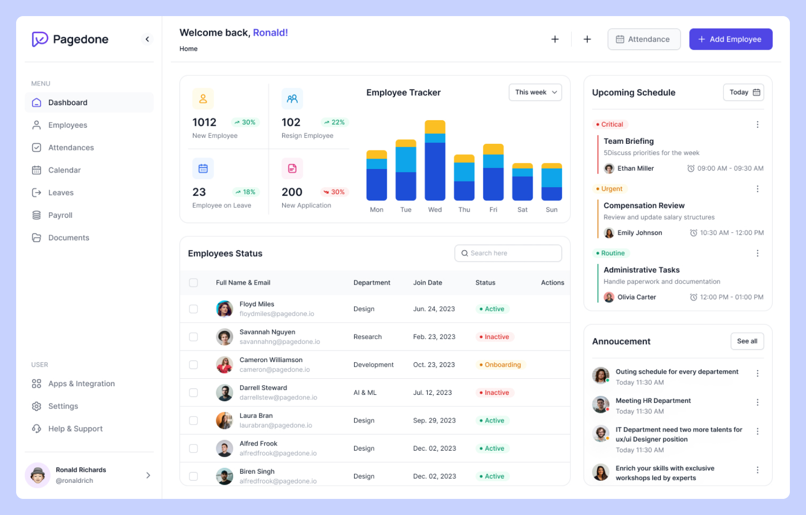

   
    
   

  <h3 align="center">📊 Attendance Tracking System</h3> 

The Attendance Tracking System is a web-based application designed to streamline and visualize student attendance using an interactive interface and real-time data visualization. This project is meant to create an advanced attendance taking system to help teachers, students and college administration by automating the entire process. Developed with HTML, CSS, and XAMPP (Apache + MySQL + PHP), the system allows users to view, record, and analyze attendance data efficiently. A standout feature is the statistical representation of daily attendance via dynamic pie charts, providing quick insights into student presence on any selected date.

🌐 Project Overview

The goal of the system is to simplify attendance management for educational institutions while offering insightful visualization to both administrators and students. It uses a MySQL database to store attendance records and PHP to manage server-side logic. The interface is crafted with HTML and CSS for a responsive and modern look.

🧰 Tech Stack

Frontend:

HTML5 – For structured content layout

CSS3 – For styling and responsive design

Chart.js – For generating pie charts dynamically

Backend & Database:

PHP – Handles database operations and server-side processing

MySQL (via XAMPP) – Stores student and attendance data

Environment:

XAMPP – A local server stack used to run and test the application

phpMyAdmin – For database administration

📈 Features

Student Dashboard: View attendance summaries with pie chart breakdowns of Present vs Absent on specific dates.

Admin Panel: Add, update, and manage student attendance records.

Date-Based Search: Select a date to retrieve and display attendance data in real-time.

Dynamic Charts: Visual representation of data using Chart.js to make analysis intuitive and engaging.

Responsive UI: Mobile-friendly interface for students and teachers to check attendance anywhere.

📌 How It Works

Login/Register: Students or faculty members log into the system.

Attendance Input: Admin manually inputs attendance into the MySQL database (or via a form).

Visualization: On selecting a specific date, PHP queries the database and returns attendance data.

Chart Rendering: Using Chart.js, a pie chart is generated showing the ratio of Present vs Absent students for that day.

📊 Example Pie Chart Use Case
On selecting April 15, 2025, a student can instantly see:

75% Present

25% Absent

Displayed in an animated, colorful pie chart with labels for clarity.

Follow me on LinkedIn : 

Follow me on Kaggle : 

Follow me on Instagram : 

Follow me on Github : 
